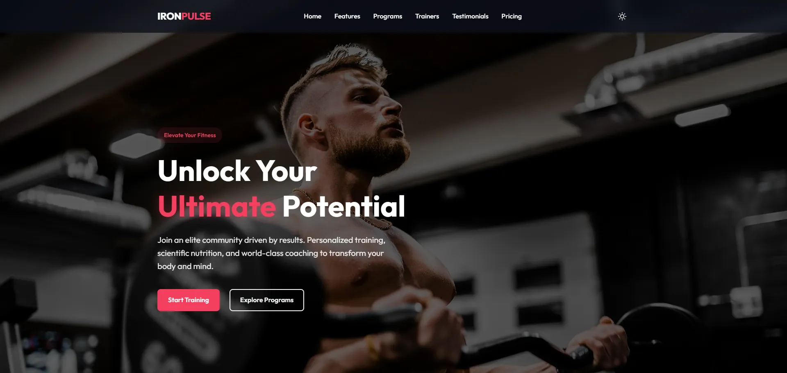
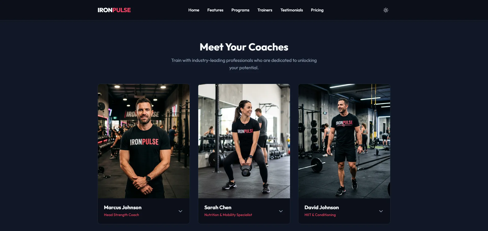
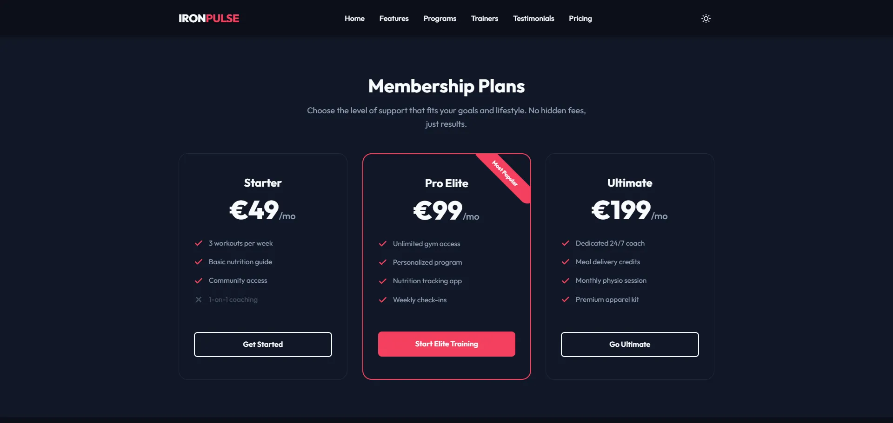

# 🏋️ IronPulse — Modern Fitness & Training

A sleek, responsive fitness landing page built with pure **HTML**, **CSS**, and **JavaScript**. Designed with a premium dark-mode aesthetic and smooth micro-animations.

---

## 🔗 Live Demo

https://rafal-jasinski-wd.github.io/iron-pulse/

---

## ✨ Features

| Feature | Description |
|---|---|
| 🌗 **Dark / Light Mode** | Theme toggle with `localStorage` persistence |
| 📱 **Fully Responsive** | Mobile-first design with a hamburger navigation |
| 🎞️ **Scroll Animations** | IntersectionObserver-powered reveal effects |
| 🧑‍🏫 **Interactive Trainer Cards** | Click-to-expand bios with accordion behavior |
| 💳 **Membership Pricing** | Three-tier pricing cards (Starter / Pro / Ultimate) |
| 📝 **Registration Form** | Goal & membership selection with a "Thank You" success state |
| 🧭 **Smooth Scrolling** | Anchor-based navigation with offset-aware scrolling |
| 🖼️ **AI-Generated Imagery** | Custom-branded trainer portraits |

---

## 📸 Screenshots

### 🖥️ Desktop View (1440px)




---

## 📁 Project Structure

```
iron-pulse/
├── index.html          # Main HTML — all sections
├── style.css           # Complete stylesheet (dark/light tokens)
├── script.js           # Theme toggle, nav, reveals, form logic
├── images/
│   ├── trainer_1_marcus.webp
│   ├── trainer_2_sarah.webp
│   ├── trainer_3_david.webp
│   └── rj-logo.webp
├── screenshots/
│   ├── hero_desktop.webp
│   ├── trainers_desktop.webp
│   └── pricing_desktop.webp
└── README.md
```

---

## 🚀 Getting Started

No build tools required — just open the file in a browser.

```bash
# Clone the repo
git clone https://github.com/rafal-jasinski-wd/iron-pulse.git

# Open in browser
start index.html        # Windows
open index.html         # macOS
xdg-open index.html     # Linux
```

Or use a local dev server for live-reload:

```bash
npx serve .
```

---

## 🎨 Tech Stack

- **HTML5** — Semantic markup, SEO meta tags
- **CSS3** — Custom properties, Grid, Flexbox, `@keyframes`
- **Vanilla JavaScript** — No frameworks, no dependencies
- **Google Fonts** — [Outfit](https://fonts.google.com/specimen/Outfit)

---

## 📸 Sections

1. **Hero** — CTA with background imagery
2. **Features** — Four icon cards (Training, Nutrition, Progress, Coaches)
3. **Programs** — Four program cards with hover overlays
4. **Trainers** — Expandable coach cards with detailed bios
5. **Testimonials** — Client reviews with star ratings
6. **Pricing** — Three membership tiers in €EUR
7. **CTA** — Full-width call to action
8. **Registration** — Contact form with success confirmation
9. **Footer** — Brand info, links, social icons, creator badge

---

## 🧑‍💻 Skills Demonstrated

- **Responsive Web Design**: Implementing a fluid, mobile-first experience using Flexbox and CSS Grid.
- **CSS Architecture**: Organized, maintainable CSS with custom properties (CSS variables) for theme management.
- **Modern JavaScript**: Using `IntersectionObserver` for performant scroll animations and DOM manipulation for interactive UI.
- **UI/UX Excellence**: Focused on accessibility (ARIA), smooth transitions, and premium aesthetic design.

---

## 👤 Author

- **Rafał Jasiński** — [GitHub Profile](https://github.com/rafal-jasinski-wd)

---

## 📄 License

This project is open source and available under the [MIT License](LICENSE).
